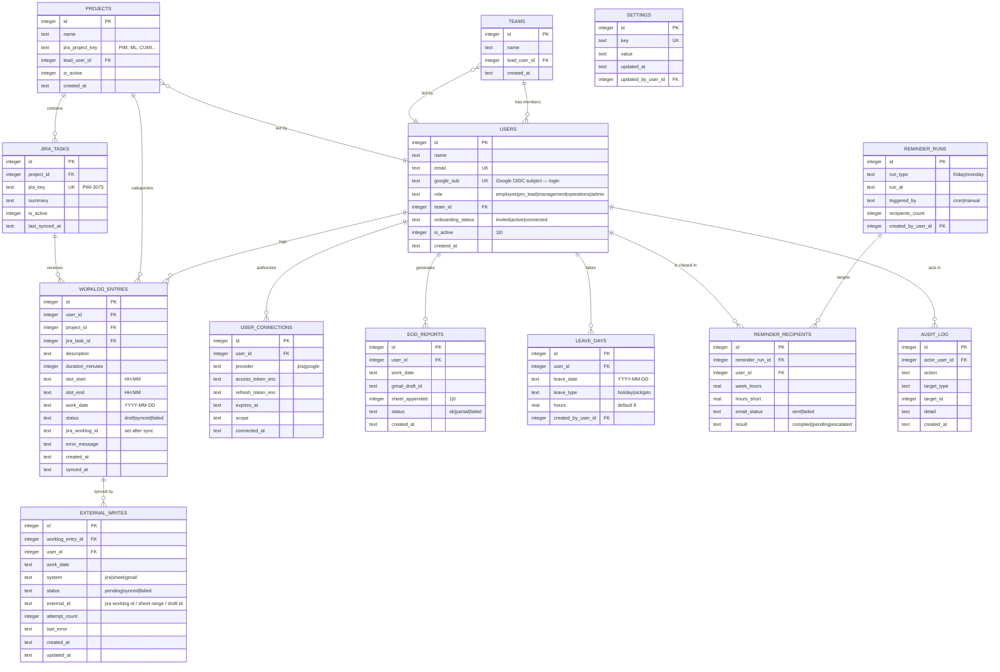

# AutoClock — Engineering Requirements Document (ERD)

| | |
|---|---|
| **Project** | AutoClock — One-Click Daily Worklog & EOD Reporter |
| **Document** | ERD v1.0 — the technical "how", including the Entity-Relationship Diagram |
| **Owner** | Yogesh Mohite · Build team of 5 |
| **Hard rules** | Zero cost · built for the real ~60 users |
| **Reads from** | `AutoClock_PRD.md` (US / FR / GM IDs) |
| **Feeds** | `AutoClock_WorkPlan.md`, `AutoClock_DevDoc.md` |

> This document doubles as both senses of "ERD": the **Engineering Requirements Document** (NFRs, ADRs, API contracts, integration specs) **and** the **Entity-Relationship Diagram** of the database (§5).

---

## 1. System Overview

```
┌─────────────────────────┐      ┌─────────────────────────┐
│  CHROME EXTENSION (MV3)  │      │   WEB APP (React+Vite)  │
│  popup · reminders ·     │      │  log · 5 role dashboards │
│  chrome.alarms/storage   │      │                         │
└────────────┬────────────┘      └────────────┬────────────┘
             │        HTTPS / REST / JSON      │
             └────────────────┬────────────────┘
                              ▼
   ┌────────────────────────────────────────────────────┐
   │   AUTOCLOCK BACKEND  (Node + Express, self-hosted)  │
   │   • Auth + RBAC + per-user OAuth token store        │
   │   • Free deterministic parser                       │
   │   • Sync orchestrator (Jira · Sheets · Gmail)       │
   │   • node-cron (Fri/Mon compliance)                  │
   │   • SQLite (WAL mode)                               │
   └───────┬───────────────┬───────────────┬─────────────┘
           ▼               ▼               ▼
   Jira Cloud API   Google Sheets API   Gmail API
   (per-user token) (per-user token)   (per-user token)
           │
   Clockwork Lite reads the native Jira worklogs and displays them.
```

Everything runs on free / already-owned components — see §3.

---

## 2. Non-Functional Requirements (FURPS+)

Sized for **~60 users**, not 500. No gold-plating.

| Area | Requirement |
|---|---|
| **Functionality** | All P0 functional requirements (PRD §8) work end-to-end with correct per-user attribution |
| **Usability** | A full day logs in < 2 min (NSM); WCAG 2.1 AA basics (PRD §11) |
| **Reliability** | A failure in one of the three external systems must not block the other two; failed writes are retryable; no silent data loss |
| **Performance** | API responses < 500 ms for local operations; an EOD sync of ~8 entries completes < 10 s |
| **Supportability** | One backend, one DB file, plain stack; any team member can run it locally in < 15 min |
| **+ Security** | Per-user OAuth; tokens encrypted at rest; HTTPS; secrets in env; RBAC enforced server-side |
| **+ Scalability** | SQLite (WAL) + node-cron are sufficient for 60 concurrent-ish users; PostgreSQL is the documented free upgrade path if it ever grows |
| **+ Cost** | ₹0 running cost — non-negotiable (GM-05) |

---

## 3. Technology Stack — all free / open-source

| Layer | Choice | Licence / cost |
|---|---|---|
| Backend runtime | Node.js 18+ + Express | MIT · free |
| Database | SQLite 3 (WAL mode) | Public domain · free |
| Web frontend | React 18 + Vite | MIT · free |
| Charts | Chart.js | MIT · free |
| Extension | Vanilla JS, Manifest V3 | free |
| Scheduler | node-cron | MIT · free |
| Email send (reminders) | Nodemailer via Gmail API | free |
| Process manager | PM2 | MIT · free |
| Hosting | Existing Iksula internal server | already owned |
| Source control | Git (Iksula's existing GitHub/GitLab) | already owned |
| Parser | Custom deterministic JS — no paid AI | free |

---

## 4. Architecture Decision Records (ADR)

**ADR-01 — Per-user authentication, never a shared bot account.**
*Context:* A Jira worklog is always attributed to the account whose token made the call; the `author` field is ignored.
*Decision:* Each user connects their own Jira + Google accounts (OAuth); AutoClock writes with the user's own token.
*Consequence:* Worklogs are correctly attributed. Adds a one-time per-user connect step. The hackathon demo uses one user's personal API token. *(Implements US-03.)*

**ADR-02 — Free deterministic parser, no paid AI.**
*Context:* Hard rule = zero cost. The employee already picks the project + Jira task, so AI ticket-guessing is unnecessary.
*Decision:* Parse durations and tidy descriptions with regex + a small rules table.
*Consequence:* ₹0, instant, offline-capable, no data sent to any external AI. An optional free self-hosted model (Ollama) is a future nicety. *(Implements FR-03, GM-05.)*

**ADR-03 — Self-host on an Iksula server; not Vercel/cloud.**
*Context:* Vercel's free tier is non-commercial and cannot run cron; any commercial tier costs money.
*Decision:* Self-host the Node backend on an existing Iksula internal server with PM2.
*Consequence:* ₹0, supports cron, and no employee data leaves Iksula's network.

**ADR-04 — SQLite (WAL mode), not PostgreSQL.**
*Context:* ~60 users. PostgreSQL would be free but adds operational weight.
*Decision:* SQLite with Write-Ahead Logging.
*Consequence:* Zero DB setup; handles 60 users comfortably; documented upgrade path to PostgreSQL if ever needed.

**ADR-05 — Write to native Jira worklog API; Clockwork just displays.**
*Context:* Clockwork (Free/Lite/Pro) reads native Jira worklogs automatically.
*Decision:* AutoClock calls `POST /rest/api/3/issue/{key}/worklog`; it never calls a Clockwork write API (Lite has none).
*Consequence:* Simple, free, works with Clockwork Lite. *(Implements FR-05.)*

**ADR-06 — Chrome extension delivered unpacked / force-installed; no public Web Store.**
*Context:* The public Web Store has a one-time developer fee and a review delay.
*Decision:* Unpacked for dev/demo; force-install for the 60 via the Google Workspace Admin Console.
*Consequence:* ₹0, instant, no review queue.

**ADR-07 — Gentle, configurable reminder cadence.**
*Context:* Aggressive hourly pings cause notification fatigue.
*Decision:* Default to a few nudges/day; user-configurable; EOD-only mode available. *(Implements FR-15, US-05.)*

**ADR-08 — Three Jira credential roles; no Clockwork access.**
*Context:* A Jira worklog is attributed to the calling token's owner. An Atlassian *Organisation* API key only reaches the admin API — it cannot read Jira issues or worklogs. Clockwork stores nothing of its own; it displays native Jira worklogs.
*Decision:* AutoClock uses **three** credential roles, and **zero Clockwork access**:
1. **Each employee's own** Jira credential (personal token → OAuth) — to **write** that employee's worklogs.
2. **One broad "Browse Projects" account** (the Operations member's) — to **read all** employees' worklogs for the Operations & Management dashboards, in bulk via `worklog/updated` + `worklog/list`.
3. The **org admin API key** — optional, used only to import the employee roster into the Admin console; never for Jira worklogs.
*Consequence:* Correct attribution on writes; complete, historical data on the dashboards (captures hours logged outside AutoClock too); stays zero-cost (Clockwork's own API is a paid Pro feature, never used). *(Implements FR-05, FR-21.)*

**ADR-09 — Idempotent sync with a durable `external_writes` ledger.**
*Context:* "Close My Day" writes to three external systems. A double-click, a refresh mid-sync, or a retry after a partial failure could create **duplicate** Jira worklogs or Sheet rows. A single `status` column cannot track per-system state or support a safe retry.
*Decision:* Add table **TB-13 `external_writes`** — one durable row per (entry, target system) with `status`, `external_id`, `attempt_count`, `last_error`. `POST /api/day/close` is **idempotent** per `(user_id, work_date)`: it skips any write already `synced`, retries only `failed` ones, and records the returned `external_id` so a re-run never duplicates.
*Consequence:* Safe retries, honest partial-failure handling, an audit trail. *(Implements FR-08, FR-22.)*

**ADR-10 — Google Workspace sign-in (OIDC) for AutoClock login.**
*Context:* `users` had no login mechanism. Passwords mean storage, reset flows, and risk.
*Decision:* AutoClock sign-in uses **Google Workspace OAuth/OIDC** — the user signs in with their Iksula Google account. `users` stores `google_sub` (the stable Google identity) and `onboarding_status`. This is separate from the per-user *API* tokens for Jira/Google writes.
*Consequence:* Zero-cost, no passwords, fits the org, clean onboarding for 60 users. *(Implements FR-23.)*

**ADR-11 — Require a classic Jira API token for the hackathon.**
*Context:* A **classic** API token authenticates against `https://{site}.atlassian.net/rest/api/3/...`. A **scoped** API token must use the gateway `https://api.atlassian.com/ex/jira/{cloudId}/rest/api/3/...` and therefore needs the `cloudId`.
*Decision:* Request a **classic** token from the admin for the hackathon — the integration code then uses the site URL directly. If only a scoped token is available, the backend must switch to the gateway base URL with `JIRA_CLOUD_ID` (from `/_edge/tenant_info`).
*Consequence:* Removes a base-URL ambiguity that would otherwise break the worklog calls. *(Corrects an earlier doc error that said cloudId is "OAuth-only".)*

---

## 5. Database Schema — Entity-Relationship Diagram


*Diagram files: `AutoClock_ERD_Diagram.png` / `.svg` (rendered) and `AutoClock_ERD_Diagram.mermaid` (editable source). Mermaid source below.*



### 5.1 Data Dictionary (key tables)

**TB-01 `users`** — every AutoClock user. `role` drives RBAC. `team_id` → `teams`.
**TB-02 `teams`** — a team; `lead_user_id` is the PM/Lead who can see it.
**TB-03 `projects`** — a project mapped to a Jira project key; powers the project dropdown.
**TB-04 `jira_tasks`** — cached Jira issues per project; powers the dependent task dropdown; refreshed periodically.
**TB-05 `worklog_entries`** — the core table; one row per logged slot. `status` moves draft → synced (or failed). `jira_worklog_id` is filled after a successful Jira write.
**TB-06 `user_connections`** — per-user OAuth tokens (encrypted) for Jira and Google. One row per provider per user (ADR-01).
**TB-07 `eod_reports`** — one row per user per day: did the Sheet append and Gmail draft succeed.
**TB-08 `reminder_runs` / TB-09 `reminder_recipients`** — the Operations Friday/Monday chase: each run and who it targeted.
**TB-10 `leave_days`** — approved leave; reduces the weekly target (FR-17).
**TB-11 `settings`** — global config (reminder cadence, weekly target hours, default meeting ticket).
**TB-12 `audit_log`** — who changed what (admin actions, syncs).
**TB-13 `external_writes`** *(added per Codex review)* — the durable sync ledger: one row per (worklog entry × target system). Drives idempotent "Close My Day", per-system retry, and partial-failure reporting. `status` moves pending → synced (or failed); `external_id` holds the Jira worklog ID / Sheet range / Gmail draft ID so a re-run never duplicates a write. *(ADR-09.)*

### 5.2 Seed Data (for the demo)
- 5 roles seeded; ~8–10 sample users across 2 teams.
- Projects: SiteOne PIMCore (PIM), Modern Electronics Lego (ML), CUMI Pimcore (CUMI), Internal/Meetings (INTERNAL), Bench (BENCH).
- `jira_tasks` seeded from the example tickets (PIM-3073, PIM-3162, ML-1045, …).
- `settings`: `reminder_cadence=gentle`, `weekly_target_hours=40`, `default_meeting_ticket=INTERNAL-1`.

---

## 6. API Contract (Backend REST)

All endpoints are JSON over HTTPS; all (except auth) require a session and enforce RBAC.

| ID | Method & Path | Purpose | Role |
|---|---|---|---|
| EP-01 | `POST /api/auth/login` | Sign in | all |
| EP-02 | `GET /api/auth/jira/connect` | Start Jira OAuth (3LO) | employee+ |
| EP-03 | `GET /api/auth/jira/callback` | Jira OAuth callback → store token | employee+ |
| EP-04 | `GET /api/auth/google/connect` | Start Google OAuth | employee+ |
| EP-05 | `GET /api/auth/google/callback` | Google OAuth callback → store token | employee+ |
| EP-06 | `GET /api/projects` | List projects (dropdown) | employee+ |
| EP-07 | `GET /api/projects/:id/tasks` | Jira tasks for a project (dependent dropdown) | employee+ |
| EP-08 | `GET /api/entries?date=YYYY-MM-DD` | The day's entries | employee (self) |
| EP-09 | `POST /api/entries` | Create a work entry | employee (self) |
| EP-10 | `PUT /api/entries/:id` | Edit an entry | employee (self) |
| EP-11 | `DELETE /api/entries/:id` | Delete an entry | employee (self) |
| EP-12 | `POST /api/day/preview` | Parse + group the day → preview payload | employee (self) |
| EP-13 | `POST /api/day/close` | Sync: Jira worklogs + Sheet + Gmail draft | employee (self) |
| EP-14 | `GET /api/dashboard/team` | PM/Lead team metrics | pm_lead |
| EP-15 | `GET /api/dashboard/org` | Management org metrics | management |
| EP-16 | `GET /api/ops/compliance?week=NN` | Weekly compliance tracker | operations |
| EP-17 | `POST /api/ops/run-check` | Run Friday/Monday check (`{type}`) | operations |
| EP-18 | `GET /api/ops/reminders` | Reminder history / email log | operations |
| EP-19 | `GET/POST/PUT /api/admin/users` | Manage users & roles | admin |
| EP-20 | `GET/POST /api/admin/projects` | Manage projects + Jira mapping | admin |
| EP-21 | `GET/POST /api/leave` | View / add leave days | operations, admin |
| EP-22 | `GET/PUT /api/admin/settings` | Global settings | admin |
| EP-23 | `POST /api/worklogs/sync` | Pull all Jira worklogs since a date (`{since}`) via the Browse-Projects account → powers Operations & Management dashboards | operations, admin |

**Example — EP-09 `POST /api/entries`**
```json
Request:  { "project_id": 1, "jira_task_id": 12, "description": "UOM rules test cases",
            "duration_minutes": 90, "slot_start": "14:30", "slot_end": "16:00",
            "work_date": "2026-05-22" }
Response: { "id": 481, "status": "draft", ...echo }
```

**Example — EP-13 `POST /api/day/close`**
```json
Request:  { "work_date": "2026-05-22", "confirmed": true }
Response: {
  "jira":   { "ok": 6, "failed": 0, "worklog_ids": ["100231", ...] },
  "sheet":  { "ok": true, "rows_appended": 6 },
  "gmail":  { "ok": true, "draft_id": "r-559..." },
  "overall": "ok"
}
```
**EP-13 is idempotent (ADR-09).** It is keyed on `(user_id, work_date)`. Before each external write it checks `external_writes` (TB-13): a row already `synced` is skipped, a `failed` row is retried, and the returned `external_id` is stored. A double-click, a refresh mid-sync, or a retry therefore **never** creates a duplicate worklog, Sheet row, or draft. The response always reflects the *current* per-system state.

---

## 7. External Integration Specs

### 7.1 Jira Cloud — create a worklog
- **Endpoint:** `POST https://your-domain.atlassian.net/rest/api/3/issue/{jiraKey}/worklog`
- **Auth (hackathon):** Basic — `base64(email:API_TOKEN)`. **Auth (pilot):** OAuth 2.0 (3LO), per user.
- **Attribution:** the worklog is recorded against the **token owner** — hence per-user auth (ADR-01).
- **Body:**
```json
{
  "timeSpentSeconds": 5400,
  "started": "2026-05-22T14:30:00.000+0530",
  "comment": {
    "type": "doc", "version": 1,
    "content": [{ "type": "paragraph",
      "content": [{ "type": "text", "text": "UOM rules test cases" }] }]
  }
}
```
- `started` must be sent with the correct **IST offset (+0530)**; Jira stores UTC internally (see §11).
- Required permissions: *Browse Projects* + *Work On Issues* on the target project.
- **Base URL depends on the token type (ADR-11):** a **classic** API token uses `https://{site}.atlassian.net/rest/api/3/...`; a **scoped** API token must use the gateway `https://api.atlassian.com/ex/jira/{cloudId}/rest/api/3/...` (get `cloudId` from `https://{site}.atlassian.net/_edge/tenant_info`). **Request a classic token** for the hackathon.

### 7.2 Atlassian OAuth 2.0 (3LO) — per-user connect
1. Register an OAuth 2.0 app at `developer.atlassian.com` (free).
2. Redirect the user to the authorization URL with: `client_id`, `scope` (space-separated), `redirect_uri`, `state`, `response_type=code`, `prompt=consent`, `audience=api.atlassian.com`.
3. Atlassian shows a consent screen → redirects back with `?code=...`.
4. Exchange the code at the token endpoint for `access_token` + `refresh_token`.
5. Store both (encrypted) in `user_connections`.
- **Scopes:** `read:jira-work`, `write:jira-work`, `offline_access` (for refresh).
- **Rotating refresh tokens (important):** Atlassian 3LO uses *rotating* refresh tokens — **every** refresh returns a **new** refresh token and disables the one just used. The backend must **atomically overwrite** the stored refresh token on every refresh, or the pilot will randomly lose Jira access. A refresh token also expires after ~90 days of inactivity → the user must re-connect.

### 7.3 Google Sheets — append a timesheet row
- **Library:** `googleapis` (npm, free).
- **Call:** `sheets.spreadsheets.values.append({ spreadsheetId, range, valueInputOption: "USER_ENTERED", requestBody: { values: [[...]] } })`.
- **Scope:** `https://www.googleapis.com/auth/spreadsheets`.
- Append only to the defined data range; validate against a copy of the real sheet first (the sheet may have formulas/merged cells).

### 7.4 Gmail — create the EOD draft
- **Call:** `gmail.users.drafts.create({ userId: "me", requestBody: { message: { raw: base64UrlEncodedMIME } } })`.
- **Scope:** `https://www.googleapis.com/auth/gmail.compose` (narrowest scope that allows draft creation).
- The MIME message carries the HTML EOD table; the draft lands in the user's own Gmail.

### 7.5 Chrome extension ↔ backend
- The extension is a normal REST client of the backend (HTTPS).
- `host_permissions` includes the backend URL.
- It is **not** connected via `chrome.storage` to the web app — both are independent clients of the one backend.

### 7.6 Jira — read ALL worklogs (for the Operations & Management dashboards)
The dashboards need every employee's hours, including history. AutoClock pulls this from Jira with the **one broad "Browse Projects" account** (the Operations member's — ADR-08):
1. **`GET /rest/api/3/worklog/updated?since={unixMillis}`** — returns the IDs of all worklogs changed since the timestamp (e.g. 1 Mar 2026); paginate via `nextPage` / `lastPage`.
2. **`POST /rest/api/3/worklog/list`** with `{ "ids": [...] }` — returns full worklog objects: `author` (the employee), `timeSpentSeconds`, `started` (work date), `issueId`, `comment`.
3. AutoClock filters by `started` date, aggregates by employee × day/week, and caches the result for the dashboards (EP-23). This reproduces the Clockwork Timesheet grid inside AutoClock.
- A worklog is returned only if the calling account has **Browse Projects** on its project — hence the broad account.
- **No Clockwork API is involved** — this is the same native Jira worklog data Clockwork displays. AutoClock needs **zero Clockwork access**.

### 7.7 Atlassian Organisation API key — what it can and cannot do
The org admin API key works **only** with the Atlassian admin API (`api.atlassian.com/admin/...`) — managing org users, groups, directories, policies. It **cannot** read Jira issues or worklogs. Its only optional use in AutoClock: the Admin console importing the employee roster. It is never on the worklog path.

---

## 8. Authentication & Authorization

- **Sessions:** signed HTTP-only cookie (or JWT) after `POST /api/auth/login`.
- **Per-user provider tokens:** Jira + Google OAuth tokens in `user_connections`, encrypted at rest; refreshed via the refresh token.
- **RBAC matrix:**

| Capability | Employee | PM/Lead | Management | Operations | Admin |
|---|:--:|:--:|:--:|:--:|:--:|
| Log / edit own entries, Close My Day | ✅ | ✅ | – | – | – |
| See own data | ✅ | ✅ | ✅ | ✅ | ✅ |
| See own team's data | – | ✅ | ✅ | – | – |
| See all teams (aggregate) | – | – | ✅ | ✅ (hours) | ✅ |
| Run compliance check / reminders | – | – | – | ✅ | ✅ |
| Manage users, roles, projects, settings | – | – | – | – | ✅ |

Authorization is enforced **server-side** on every endpoint — never trusted from the client.

---

## 9. SLO / SLI (lightweight, for 60 users)

| SLI | SLO |
|---|---|
| Backend API availability (working hours) | ≥ 99% |
| Local API response time | < 500 ms (p95) |
| EOD sync completion (~8 entries) | < 10 s (p95) |
| Worklog write success rate | ≥ 99% (excluding genuine Jira-permission errors) |
| Friday/Monday cron executes on schedule | 100% (alert the ops user if a run is missed) |

---

## 10. Privacy Threat Model (lightweight)

| Threat | Mitigation |
|---|---|
| Token theft → unauthorized Jira/Google access | Encrypt tokens at rest; HTTPS only; secrets in env; least-scope OAuth |
| One role sees another's detailed data | Server-side RBAC (§8); management sees aggregates only |
| Tool perceived as surveillance | No screenshots/keystrokes; users see their own data; transparent purpose |
| Data leaves Iksula | Self-hosted on Iksula infra; no external AI calls |
| Wrong worklog corrupts real Jira | Mandatory preview + confirm before any write (FR-04) |

---

## 11. Timezone Handling

All staff work in **IST (UTC+5:30)**; Jira Cloud stores worklogs in **UTC**.
- On write: build `started` with the explicit `+0530` offset so Jira records the correct instant.
- On read/display: convert UTC → IST.
- The Google Sheet stays in IST.
- Test: log a slot near midnight IST and confirm Clockwork shows it on the correct day.

---

## 12. Deployment / Infrastructure

- **Host:** an existing Iksula internal Linux server (confirm with Tejas — OQ-2).
- **Run:** Node backend under **PM2** (auto-restart, free); SQLite file on local disk with scheduled file backup.
- **Web app:** built static assets (`vite build`) served by the same Express server.
- **Extension:** force-installed via the Google Workspace Admin Console.
- **HTTPS:** internal certificate or Let's Encrypt (free).
- **Secrets:** `.env` on the server, never in Git.
- **Backup:** nightly copy of the SQLite file.

---

## 13. Cross-Team Dependency Map

| Dependency | Needed for | Owner | Status |
|---|---|---|---|
| Jira access — 3-day token (hackathon) → OAuth (pilot) | Worklog writes (FR-05) | Yogesh + Atlassian admin | ✅ confirmed with admin |
| Broad "Browse Projects" account token | Reading all worklogs for dashboards (FR-21, §7.6) | Operations team member | ⏳ token to be generated |
| Internal server to host | Deployment (ADR-03) | Tejas / IT Infra | ⏳ to confirm (OQ-2) |
| Real Google Sheet structure | Sheet append (FR-06) | Ravi | ⏳ to obtain (OQ-3) |
| Real EOD email template | Gmail draft (FR-07) | Yogesh | ⏳ to obtain (OQ-4) |
| Leave / holiday data | Ops target (FR-17) | Tejas / HR | ⏳ to confirm (OQ-5) |
| Workspace Admin (extension force-install) | Pilot rollout | Tejas | ⏳ pilot phase |

---

## 14. Scope & Codex-Review Clarifications

These resolve the remaining points from the Codex audit (`AutoClock_Codex_Review.md`).

### 14.1 M0 vs M1 labelling
Priority already encodes the build phase: **P0 = M0** (built at the hackathon), **P1 = M1** (pilot), **P2 = stretch** (only if the core is solid by Hour 12), **P3 = future**. EP-23 (worklog read-sync), the Chrome extension, the Operations cron, Admin CRUD, leave handling and per-user OAuth onboarding are **M1/stretch — not M0**.

### 14.2 Jira task dropdown — source rule (EP-07 / TB-04)
- **M0 (hackathon):** `jira_tasks` is **admin-seeded** — a fixed set of demo tickets per project (ERD §5.2). EP-07 just returns the active rows for the chosen project. Simple and reliable.
- **M1 (pilot):** EP-07 queries Jira live with JQL — `project = {KEY} AND (assignee = currentUser() OR updated >= -30d) ORDER BY updated DESC`. To support this, `jira_tasks` gains `assignee_account_id`, `status`, `issue_type`, `updated_at`; refreshed on a schedule. Issue-security-restricted tickets simply will not appear (acceptable).

### 14.3 Per-user routing config
"Append to *the user's* Sheet" and "draft to *the user's* lead" need per-user values. `users` (TB-01) carries: `sheet_id`, `sheet_range`, `eod_recipient_email`. For the **M0 demo** these are config constants for the one demo user; for **M1** they are set per user during onboarding (or inherited from a team default). The exact Sheet columns/range and EOD template are **OQ-3 / OQ-4** — freeze them before Friday (a row-per-ticket append to a defined A1 range; see Dev Doc §6.3).

### 14.4 Token encryption format (TB-06)
Each encrypted token is stored as a single string `iv:authTag:ciphertext` (each part base64), using AES-256-GCM with `TOKEN_ENC_KEY` from the environment. No key rotation in M0; if the key is lost, users simply re-connect. Never store ciphertext without its IV and auth tag.

### 14.5 Role vs dashboard scope
**M0:** one dashboard component rendered with two datasets — PM scope (own team) and Management scope (all teams). Separate fully-polished Management / Operations / Admin screens are **M1**. EP-14 and EP-15 stay distinct endpoints (different visibility) even though they share one UI component.

### 14.6 Offline extension entries
The PRD mentions offline capture. For **M0 this is out of scope** — the extension requires connectivity to save. Offline (local `chrome.storage` queue + reconciliation on reconnect) is an **M1** item; until then the popup shows a clear "offline — will not save" state.

---

*Traceability: TB = table · EP = endpoint · ADR = decision. The Work Plan references these IDs.*

*End of ERD v1.0 — AutoClock, Iksula HackFest 2026.*
